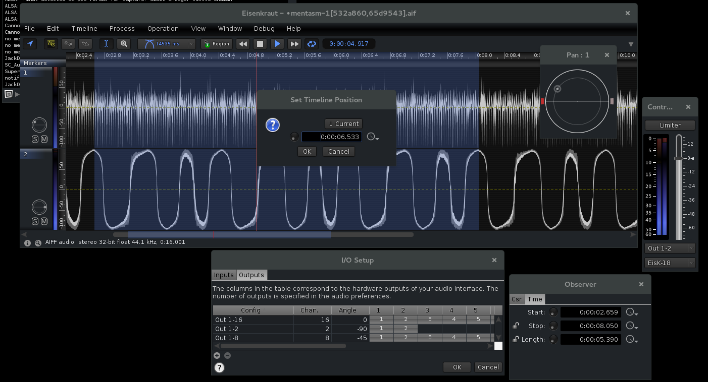

# Eisenkraut

## statement

Eisenkraut is a standalone, cross-platform audio file editor using the SuperCollider 3 server application.

Eisenkraut is (C)opyright 2004&ndash;2018 by Hanns Holger Rutz. All rights reserved. It is released under the [GNU General Public License](http://github.com/Sciss/Eisenkraut/blob/master/licenses/Eisenkraut-License.txt).

To contact the author, send an email to `contact at sciss.de`. For project status, API and current version visit [github.com/Sciss/Eisenkraut](http://github.com/Sciss/Eisenkraut).

Please consider supporting this project through Liberapay (see badge above) – thank you!

## downloading

A binary version of Eisenkraut for all platforms is provided through [GitHub Releases](https://github.com/Sciss/Eisenkraut/releases/latest).

## setting up and running

### installing supercollider

Eisenkraut uses the [SuperCollider](https://supercollider.github.io/) server as the audio playback engine. You need to install a recent SuperCollider 3 version to run this software. The recommended version of SuperCollider is 3.8.0.
__Warning:__ The version 3.6.6 of SuperCollider is defect, in particular the multi-channel support for streaming sound-files is broken.

### starting eisenkraut

To launch Eisenkraut, you use the `eisenkraut` shell script (Linux and OS X) or the `eisenkraut.bat` script (Windows). When using the Debian package, you have `eisenkraut` on your path and can find a desktop entry to add to your favourites.

After launching Eisenkraut for the first time, make sure that the "SuperCollider Server (scsynth)" field in the audio preferences is pointing to the valid `scsynth` or `scsynth.exe` (on Windows) file! __On OS X, newer SuperCollider versions "hide" the `scsynth` command line tool inside the `SuperCollider.app` bundle.__ So the correct path will be something like `/Applications/SuperCollider/SuperCollider.app/Contents/Resources/scsynth`.

Also note that, by default, the audio server is not automatically booted, so you need to press the "Boot" button in the main window to launch the server and be able to actually _hear_ the sound file when playing it back. There is a preferences switch to enable automatic booting.

## building from source

Eisenkraut can be build from source with [sbt](http://www.scala-sbt.org/#install).

 - to compile: `sbt compile`
 - to package: `sbt package`
 - to run: `sbt run`
 - to make a standalone jar: `sbt assembly`
 
The release bundles are produced with tasks `universal:packageBin` and `debian:packageBin`.

## source code distribution

Eisenkraut's GPL'ed source code is made available through [github.com/Sciss/Eisenkraut](http://github.com/Sciss/Eisenkraut).

- As a SuperCollider client it uses the JCollider library, which is also licensed under the GNU Lesser General Public License (LGPL). The compiled library is included, for source code and details visit [github.com/Sciss/JCollider](https://github.com/Sciss/JCollider).
- For OSC communication, the NetUtil library is used, which is licensed under the GNU Lesser General Public License (LGPL), for source code and details visit [github.com/Sciss/NetUtil](https://github.com/Sciss/NetUtil).
- It uses the ScissLib library which is licensed under the GNU Lesser General Public License (LGPL), source code provided through [github.com/Sciss/ScissLib](https://github.com/Sciss/ScissLib).

## contributing

Please see the file [CONTRIBUTING.md](CONTRIBUTING.md) for details.

## documentation

Please refer to the `help/index.html` file for a list of manual topics.

A short screencast is available on [Vimeo](https://vimeo.com/26510634).

## to-do's

A lot. Here are some suggestions:

 - Still need to integrate FScape (more a job about FScape than about Eisenkraut)
 - Finding a way to edit with simultaneous video display (might be a separate app synchronized through some kind of OSC transport)
 - Optionally saving meta-information with the sound files (e.g. a separate XML file), like panorama settings, window bounds etc.
 - Finishing sonogram functionality (needs decimation and must be editable)
 - Improving SuperCollider interface and classes
 - etc. etc.

In the long-term, Eisenkraut will most likely be integrated with Mellite.
